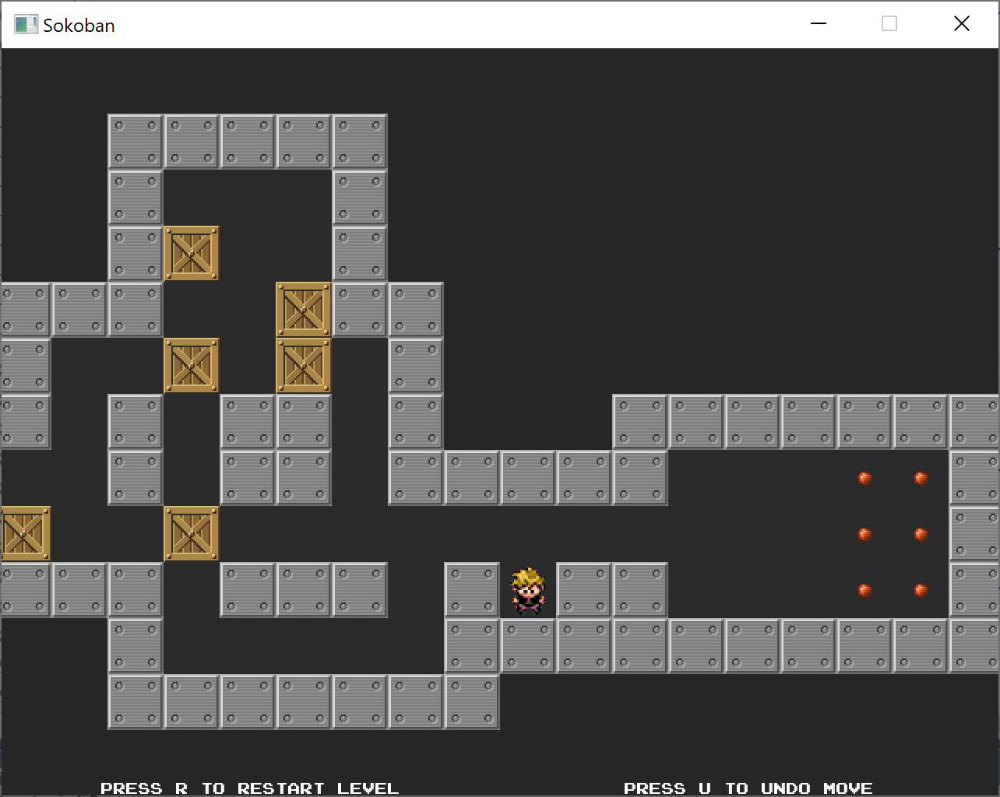

# sdl2-sokoban 

Sokoban clone written in C++ and [SDL2](https://www.libsdl.org/index.php). Maps authored using [Tiled](https://www.mapeditor.org/) map editor and loaded using [TMX C Loader](https://github.com/baylej/tmx/).

 

## Dependencies

This project depends on [SDL2](https://www.libsdl.org), [SDL_image 2.0](https://www.libsdl.org/projects/SDL_image/), [SDL_ttf 2.0](https://www.libsdl.org/projects/SDL_ttf/) and [TMX C Loader](https://github.com/baylej/tmx/), which depends on [zlib](https://www.zlib.net/) and [LibXML2](http://www.xmlsoft.org/).

### Installing dependencies on Windows

It is assumed that [tar and curl are available](https://devblogs.microsoft.com/commandline/tar-and-curl-come-to-windows/). 

Clone the repository and install dependencies by running the provided batch scripts from a *Visual Studio Native Tools Command Prompt*

    git clone https://github.com/howprice/sdl2-sokoban
	install_sdl.bat
	install_tmx.bat

Alternatively the [SDL2](https://www.libsdl.org/download-2.0.php), [SDL_image 2.0](https://www.libsdl.org/projects/SDL_image/) and [SDL_ttf 2.0](https://www.libsdl.org/projects/SDL_ttf/) Windows VC development libraries can be unzipped manually into the [3rdParty](3rdParty) folder, removing the version numbers from the directory names.

To install TMX manually see [TMX.md](TMX.md).

To use different lib versions edit the variables at the top of [install_sdl.bat](install_sdl.bat) and [install_tmx.bat](install_tmx.bat).

### Installing dependencies on Linux

Install developer libs using a package manager. For example, for Ubuntu and Raspberry Pi:

	sudo apt-get install libsdl2-dev
	sudo apt-get install libsdl2-image-dev
	sudo apt-get install libsdl2-ttf-dev
    sudo apt install libxml2-dev
    sudo apt install cmake

Clone, build and install [TMX C Loader](https://github.com/baylej/tmx/)

    git clone https://github.com/baylej/tmx
    cd tmx
    mkdir build
    cd build
    cmake ..
    make
    sudo make install   
    
### Installing dependencies on Mac OS X

    brew install sdl2
    brew install sdl2_image
    brew install sdl2_ttf
    brew install cmake
    git clone https://github.com/baylej/tmx
    cd tmx
    mkdir build
    cd build
    cmake ..
    make
    sudo make install  

## Building and Running

This project uses [GENie](https://github.com/bkaradzic/genie) to generate the build files for the target platform. The GENie executables for Windows, Linux, Mac OS X and Raspberry Pi can be found in the [tools](tools) directory for convenience.

There are three build configurations:
- Debug - no optimisations, symbols, asserts
- Dev - optimisations, symbols, asserts
- Release - optimisations, no symbols, no asserts

### Windows

Run genie_vs2017.bat or genie_vs2019.bat to generate the Visual Studio Solution and Project files into the 'build' folder. Build and run from within Visual Studio, or [build from the command line](https://docs.microsoft.com/en-us/cpp/build/building-on-the-command-line?view=vs-2017) with [MSBuild](https://docs.microsoft.com/en-us/visualstudio/msbuild/msbuild?view=vs-2017).

### Linux

Clone this repo, build the makefiles and build:

	$ git clone https://github.com/howprice/sdl2-sokoban
	$ cd sdl2-sokoban
	$ ./genie_gmake.sh  (or ./genie_raspberrypi.sh)
	$ cd build
	$ make

n.b. You may need to 'chmod +x' genie executable and or .sh shell script files.

`make` with no config specified defaults to the debug config for native architecture (usually 64-bit). Can call `make config=<xxx>` where `xxx` can be `debug`, `dev`, `release`, `debug32`, `dev32`, `release32`, `debug64`, `dev64` or `release64`. Or type `make help` for more info. Make sure you're in the `build` folder.

To run the game

	$ cd data
	$ ../bin/debug/sdl2-sokoban   (or dev or release)

### Mac OS X

Clone this repo, build the makefiles for either gcc (aliased to clang on Mac) or Xcode:

	$ ./genie_gmake.sh   // then build and run as Linux above
	
or

	$ ./genie_xcode10.sh   // then build and run in XCode

## Cleaning the build files

	$ ./genie_clean.sh

## Controls

Cursor keys

## Links and thanks

- [Tiled](https://www.mapeditor.org/)
- [baylej/tmx C tmx map loader](https://github.com/baylej/tmx)
- Yuji Adachi for the [ARCADE_N.TTF font](https://www.dafont.com/arcade-ya.font)
- [TMX Wiki](https://github.com/baylej/tmx/wiki/Build-dependencies-on-Windows)
- https://docs.microsoft.com/en-us/cognitive-toolkit/setup-buildzlib-vs17
- [YAML Lint](http://www.yamllint.com/) for validating [.travis.yml](.travis.yml) locally.

## TODO
- Build this project with cmake?
- Add support for loading standard Sokoban SOK level files https://inventwithpython.com/pygame/chapter9.html http://sokobano.de/wiki/index.php?title=Level_format 
- Figure out relative path problem when loading tileset pngs (I have manually made the paths relative in the .tmx files as a work-around)

## License

See the [LICENSE](LICENSE) file for details.
